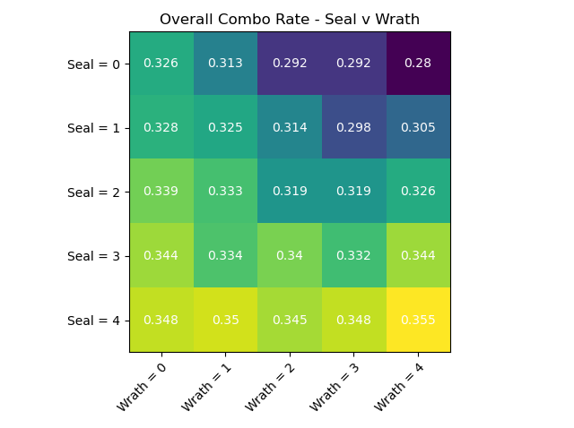

# MTG
Here's an overview of the work:
* **Core** - Engines for running simulations as well as OOP classes for Magic
* **Strategy** - Common strategy and gameplay to facillitate easy scripting for simulations
* **Decks** - Decklists to run simulations upon
* **Experiments** - Stores permutations and hyperparameters for multi dimensional simulations
* **Results** - Stores results of Experiments
* **Simulations** - Entry points into running simulations
____

Inspired by giants and geniuses in our community I'll be self experimenting with my own mix of MTG Simulations

I'm attempting to combine the following great contributions:
* Frank Karsten's masterful contributions of applying statistics and Monte Carlo simulation to foundational MTG theory
* Allen Wu's concise and to the point Monte Carlo Simulation and it's impact on competitive MTG
* Dan Pope's wonderful Github example of beautiful OOP driven MTG simulations in python
* Thomas Oldham's use of visualizations to make MTG simulations more intuitive, interactive, and actionable

And I'll be putting my own spin on the above as well.  Contributing novel concepts of context driven simulations in
addition to ML driven optimization

----

**Examples of Possible Simulations**

**Overall Combo Rate**

**Average Damage output over 3 Turns**

